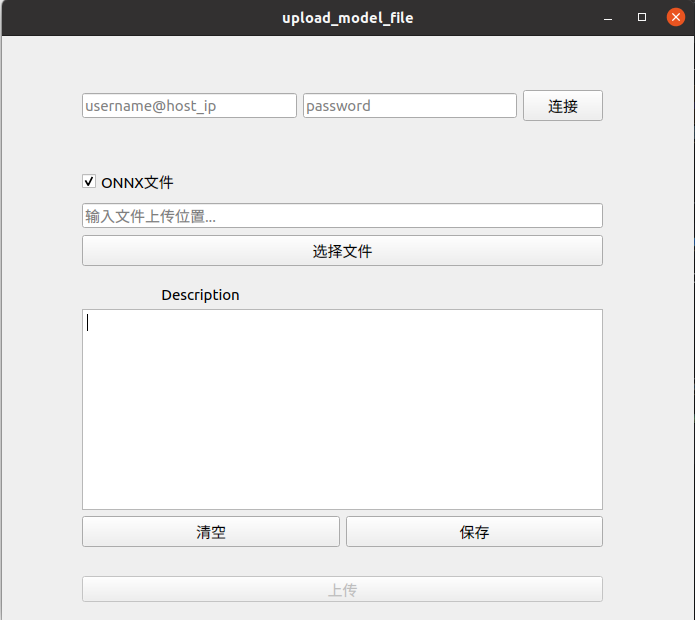

### 仓库用途: 通过可视化界面，进行模型文件的上传，并可备注此次更新的内容

---

### 环境配置: 
1. cuda环境: cuda -arch=sm_87
2. llvm环境: llvm -mtriple=aarch64-linux-gnu
3. 交叉编译环境: aarch64-linux-gnu-gcc
4. PyQt环境: PyQt5 == 5.15.9, PyQt5-Qt5 == 5.15.2, PyQt5-sip == 12.13.0

---

### 用法:
#### 1. 运行 slot_logic.py, 弹出如下界面:

#### 2. 输入某青龙机器人的用户名和ip（例：username@host_ip），输入密码，并点击 连接 按钮。
- 注: 需提前将 WIFI连接至制定机器人

#### 4. 默认勾选 ONNX文件，如果需要上传的文件中不包括 .ONNX模型文件，则取消勾选。
- 注: 选中 model.onnx文件上传即可，请勿上传压缩包

#### 5. 点击 选择文件，并选择需要上传的文件

#### 6. 在 Description 窗口中， 填写此次更新的内容或备注， 并点击保存。

#### 7. 点击 上传。
